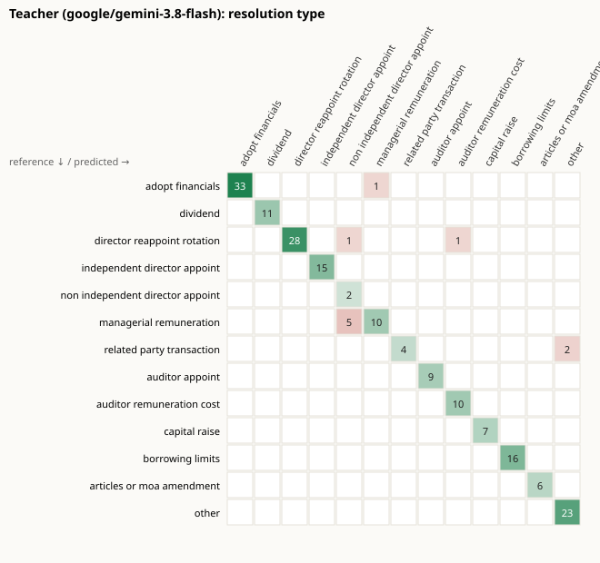
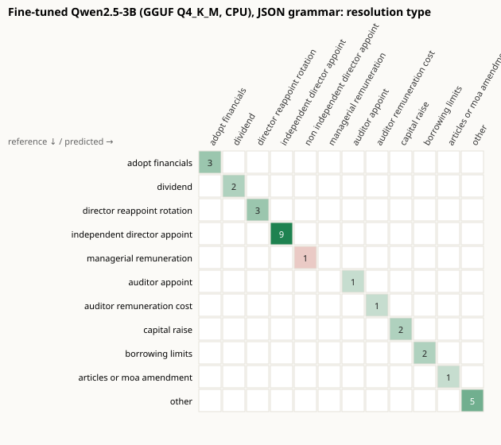
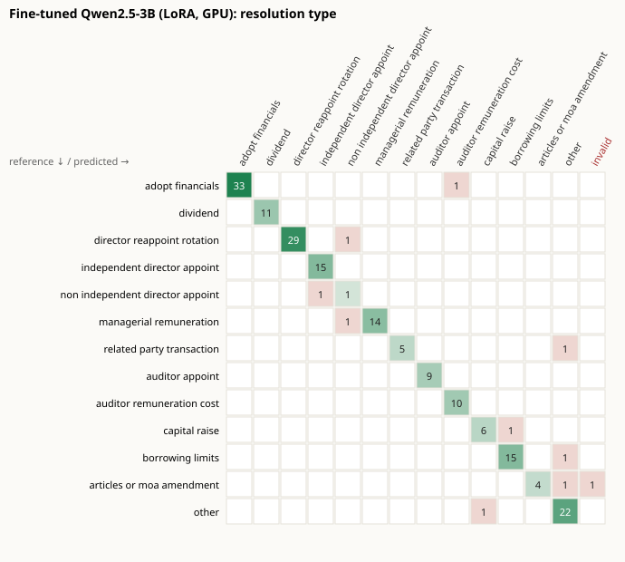
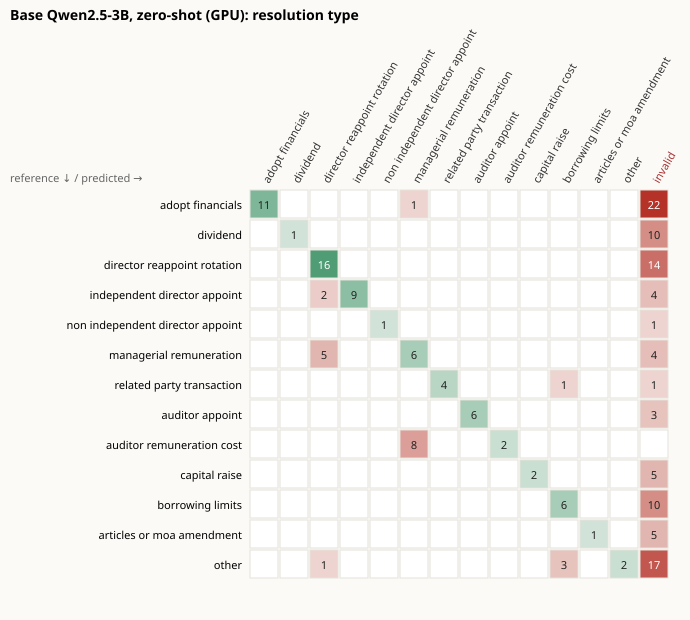
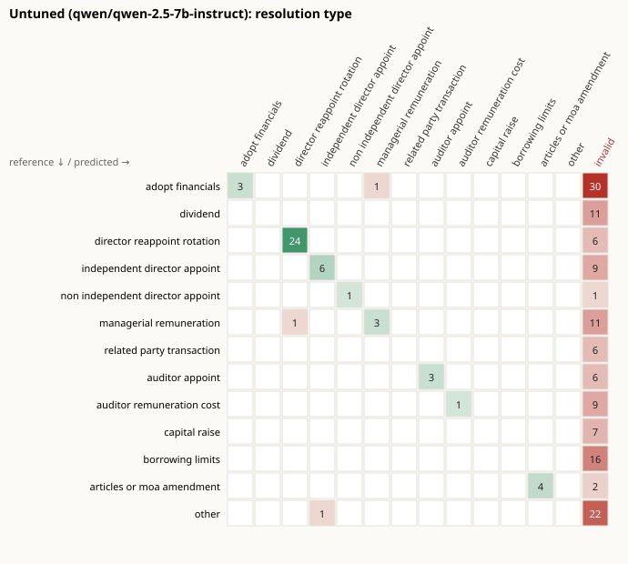

# ProxyLens evaluation report

_Generated 2026-10-05 18:58 UTC by `python -m eval.report`. Do not edit by hand._

## Reference labels

**Mixed reference (184 items): 1 human-labelled or edited, 183 model drafts (anthropic/claude-sonnet-5.5) saved unchanged.**

Scores below measure agreement with this reference. Because most labels are an independent model's, read them as agreement with that model, not as accuracy against human judgement.

## Extraction (company-held-out test split)

| Model | n | JSON valid | Type acc. | Type macro-F1 | Persons F1 | Amounts F1 | Special F1 | Counterparty F1 | Fallback | Latency p50 / p95 | Cost / 1k |
|---|---|---|---|---|---|---|---|---|---|---|---|
| Teacher (google/gemini-3.8-flash) | 184 | 100.0% | 94.6% | 91.0% | 93.2% | 91.2% | 100.0% | 66.7% | 0.0% | 2.8 s / 4.0 s | $2.74 |
| Fine-tuned Qwen2.5-3B (GGUF Q4_K_M, CPU), JSON grammar | 30 | 100.0% | 96.7% | 90.9% | 100.0% | 100.0% | 100.0% | — | 0.0% | 41.6 s / 92.8 s | $4.82 |
| Fine-tuned Qwen2.5-3B (LoRA, GPU) | 184 | 99.5% | 94.6% | 89.8% | 90.6% | 83.8% | 98.5% | 57.1% | — | 14.9 s / 26.6 s | — |
| Base Qwen2.5-3B, zero-shot (GPU) | 184 | 47.8% | 36.4% | 48.8% | 48.8% | 41.7% | 63.9% | 57.1% | — | 15.8 s / 25.7 s | — |
| Untuned (qwen/qwen-2.5-7b-instruct) | 184 | 26.1% | 24.5% | 31.1% | 61.9% | 11.5% | 32.5% | 0.0% | 34.2% | 5.0 s / 12.0 s | $0.31 |

**Not all rows cover the same items.** Fine-tuned Qwen2.5-3B (GGUF Q4_K_M, CPU), JSON grammar (n=30) was scored on the first items of the 184-item set only, so compare it with care. F1 shows — where the items contain nothing of that kind.

JSON valid is measured on the first reply, before any repair. Fallback is the share still invalid after one repair, i.e. sent to the teacher (only measured by `eval.run`; notebook runs show —). Invalid replies count as wrong in every other column.

- Fine-tuned Qwen2.5-3B (GGUF Q4_K_M, CPU), JSON grammar cost: estimate: local p50 latency x Cloud Run price (4 vCPU / 8 GiB).

## Confusion matrices

## Decision pipeline

- Citation precision before guardrails: **100.0%** (5 kept of 5 cited, over 6 analyses saved by the web app). Every citation shown to users passes the check by construction.
- Retrieval recall@6: 1.00 on 20 hand-written queries (`scripts/eval_retrieval.py`, Phase 1).
- Recommendation agreement: not measured; the reference set has no vote labels.

## Failure cases

### Failure cases: Fine-tuned Qwen2.5-3B (LoRA, GPU)

- **Bambino Agro Industries Limited**, item 4 (`682bb8696d21-4`): Predicted **NON_INDEPENDENT_DIRECTOR_APPOINT**, reference **MANAGERIAL_REMUNERATION**.
  > Re-appointment of Mr. Prabhnoor Singh Grewal (DIN: 09217422) as whole time Director (Sales) of the company for a period of two (2) years To consider and if thought fit, pass with or without modification(s), the following resolution as an Or…
- **G.R. CABLES LIMITED**, item 9 (`994ed3dba9e0-9`): Reply was not valid JSON for the schema.
  > ADOPTION OF NEW MEMORANDUM OF ASSOCIATION IN PLACE OF THE EXISTING MEMORANDUM OF ASSOCIATION OF THE COMPANY IN CONFORMITY WITH THE COMPANIES ACT, 2013: To consider and, if thought fit, to pass with or without modification following resoluti…
  Output started: `'{"item_no":9,"title":"Adoption of New Memorandum of Association in place of existing MOA","resolution_type":"ARTICLES_OR'`
- **G.R. CABLES LIMITED**, item 11 (`994ed3dba9e0-11`): Predicted **BORROWING_LIMITS**, reference **CAPITAL_RAISE**.
  > CONVERSION OF LOAN INTO EQUITY: To consider and, if thought fit, to pass with or without modification following resolution as a SPECIAL RESOLUTION: "RESOLVED, that pursuant to the provisions of Section 62(3), 179, 49 and other applicable pr…
- **Mukat Pipes Limited**, item 5 (`645380ee5e1c-5`): Predicted **OTHER**, reference **BORROWING_LIMITS**.
  > To approve sale, lease or otherwise dispose of the whole or substantially the whole of the undertaking of the company: To consider and if thought fit, to pass the following resolution as a SPECIAL RESOLUTION: “RESOLVED THAT in supersession …
- **RPSG Ventures Limited**, item 5 (`d3d22d1e87c6-5`): Predicted **CAPITAL_RAISE**, reference **OTHER**.
  > INVESTMENT LIMIT To consider and if thought fit, to pass, with or without modification(s) the following resolution as a Special Resolution: “RESOLVED THAT, in supersession of the earlier Resolution passed by the Members of the Company at th…

